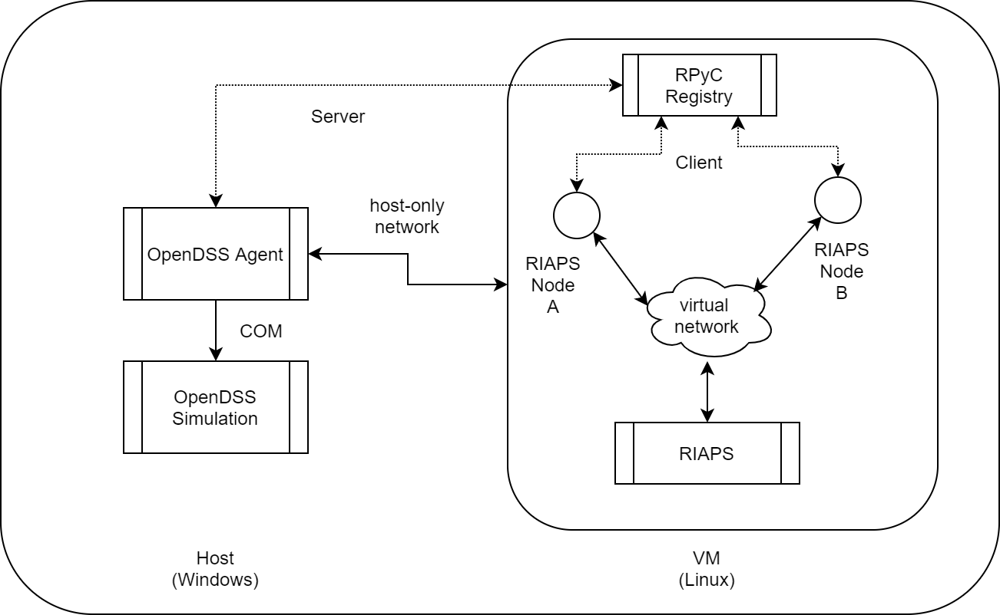

# interface.OpenDSS

## OpenDSS interface for RIAPS

It consists of an OpenDSS agent that sets up a simulation and can communicate with it using the COM interface. On one hand, the agent can receive requests from a RIAPS device component to read values of specific network parameters which it can relay to the RIAPS device component. On the other hand, it can also receive commands to set certain parameter values for the network elements.

## Network Setup

The agent uses the Windows COM interface to communicate with OpenDSS. Thus, a complete experimental setup requires a Windows host machine on which OpenDSS is installed and the agent is running, along with a Virtual Machine running Linux which has RIAPS for running the control algorithm. The RIAPS nodes can be deployed in a virtual network using Mininet (see instructions on how to set up RIAPS using Mininet in the RIAPS repository).

The network connection needs to be configured by setting up a "host only network". The steps to do so using Virtual Box are as follows:

1. Open Setings menu in Virtual Box.
2. Within the Network list, select a new Adapter tab and enable it by checking the "Enable Network Adapter" checkbox.
3. In the "Attached to" field select "Host-only Adapter".
4. Save the settings.

## Configuration

The interface requires three types of files to run.

1. An OpenDSS model file "APP.dss" that defines the simulation network.
2. A logging configuration file "APP.dsl" that contains the "object, name, attribute" tuples that the deveoper is interested in logging to a remote InfluxDB database. The specified values must either be subscribed to by the control algorithm or published to for controliing.
3. A "DSSA.yaml" configuration file for the simulation properties. This file contains values such as the solution mode, step size, physical time step etc (see the sample folder).

## Simulation Process

The OpenDSS simulation proceeds in the following way (taken from the OpenDSS manual):

- The Control Queue gets populated every time Control Objects are polled and a power flow solution is calculated (Pushed by the associated Control Objects).

- The Dispatcher pops items from the queue and dispatches them to the appropriate Control Object when the appropriate time arrives (To a virtual function called DoPendingAction in the module that pushed the action code onto the control queue).

- The COM interface has a proxy that mimics a Control Object with its own DoPendingAction function.

- An external user defined action is pushed to the CtrlQueue using the COM interface. This requires two parameters: an ActionCode which identifies the particular action and a DeviceHandle which identifies the handler for that action. A delay can also be specified for that action.

- When the time comes and that action is popped from the Control Queue by OpenDSS, it is sent to the COM Proxy and stored in an ActionList.

- The user module needs to read items from the list and then perform the required control operation.

## Agent Operation

The designed agent co-ordinates with the running simulation by reading values and sending it to the RIAPS side (where the control algorithm is run) and inserting the responses received from RIAPS as actions into the OpenDSS control queue. The steps are:

- Set the simulation mode and stepsize

- Set the maximum number of iterations

- Step the simulation by one logical time step

- Read all subscription requests and send out the values.

- Enter a custom control loop

- Wait for a specified time window for the agent to receive control commands. This is configurable in the yaml file. The simulation time is suspended at this point.

- Wake after a one second period and check if any command is received. If yes then insert an item ito the control queue with the waiting time as the delay. Otherwise sleep for one more second and continue till the specified time window has elapsed.

- Map the DeviceHandle to a python function that reads the publish commands and sets the values (this allows multiple control algorithms to be defined for multiple scenarios).

- Pop the item off the Action List of the COM Proxy and call the python function based on the DeviceHandle.
Break if maximum iterations reached or list is empty.

- Finish the current time step.

## Running the agent

To run the agent, launch the python script `riaps_dssa.py` with the application name and the application file path as command line arguments. The agent is designed to utilize the WIndows COM interface so it must be run in a Windows environment.
